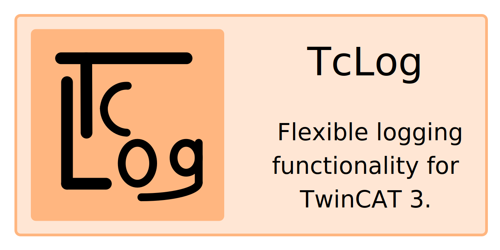

*Logging in TwinCAT with the on-board means is limited to the output as ADS event. The TcLog library presented here enables flexible logging to the file system.*

It's usage is as simple as this: 

Configure the core logger in your project:

```st
VAR
  _coreLogger : TcLogLib.TcLogCore(bufferSize := 100 * (Tc2_System.MAX_STRING_LENGTH + TcLogLib.Constants.FifoOverhead));
END_VAR

_coreLogger
  .WriteToAds()
  .WriteToFile('c:\logs\', 'sensor_data.txt')
  .MinimumLevel(TcLogLib.LogLevels.Debug)
  .RunLogger();
```

Then, maybe in a different POU, use `TcLog` to log messages:

```st
VAR
  _logger: TcLogLib.TcLog;
  _myInt : INT := 10;
  _myVarInfo : __SYSTEM.VAR_INFO := __VARINFO(_myInt);
END_VAR

_logger
  .AppendString('Let´s log some values: ')
  .AppendAny(_myInt)
  .AppendString(' - or some symbols: ')
  .AppendVariable(_myVarInfo, _myInt)
  .Error(''); 
```

This will log both messages to both the ADS output and the file system.

🚀 **Features** 🚀

- Log to ADS output
- Log to file system
- Fluent interface for easy configuration and usage
- Specification of minimum log level
- Set rolling interval for log files
- Delete old log files automatically
- Dynamically expanding log buffer
- Log messages with or without timestamp
- Custom log message formatting

🧪 **Tests** 🧪

The project contains both unit ([TcUnit](https://tcunit.org)) and integration tests ([xUnit](https://xunit.net)).

## Install TcLog
See the [installation guide](https://bengeisler.github.io/TcLog/userguide/installation.html) for instructions on how to install TcLog.

## Getting started
Get quickly up and running with TcLog: [Get Started](https://bengeisler.github.io/TcLog/userguide/getting_started.html)

## API reference
Find the full API reference [here](https://bengeisler.github.io/TcLog/reference/TcLog/Constants.html).

## License
The library is licensed under the [MIT License](LICENSE).

## Contributing
Contributions are welcome. Please see the [contribution guide](CONTRIBUTING.md) for details.

## Further ways of logging in TwinCAT
With [log4TC](https://mbc-engineering.github.io/log4TC/index.html) there is another logging option for TwinCAT.  This enables structured logging, but an additional Windows service must be installed, which communicates with the PLC library. `TcLog` on the other hand comes as a pure PLC library. 
The code for log4TC has been published as open source on [GitHub](https://github.com/mbc-engineering/log4TC/releases).

## Disclaimer
This project is not affiliated with Beckhoff Automation GmbH & Co. KG and was first published in 2021 at [my blog](https://benediktgeisler.de/en/blog/tclog/).
